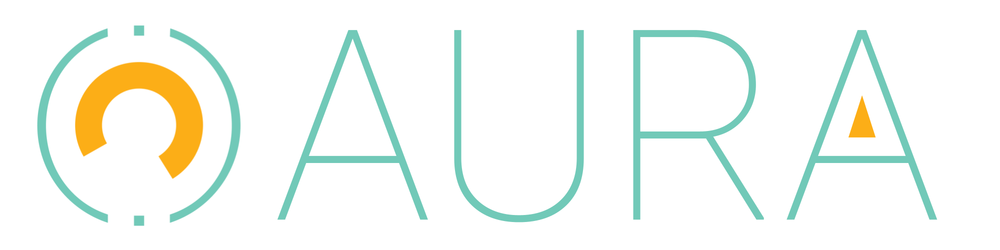

<p align="center">
    <br />
    
    
</p>

# Título

A assiste virtual do curso de Ciência da Computação - UFFS, tem por objetivo facilitar o acesso à informação por parte da comunidade acadêmica. Para isto ela utiliza técnicas de Inteligência Artifial que permitem que as informações corretas sejam fornecidas àqueles que as buscam. 

A Aura pode ser muito mais rápida que uma pessoa, trabalha 24h por dia, sete dias por semana para solucionar seus problemas. 

> **IMPORTANTE:** A Aura está em fase de desenvolvimento, portanto seus resultados de busca podem não ser satisfatórios - nada substitui um e-mail cuidadosamente escrito por uma pessoa :)

## Começando

Para que possa _buildar_ o projeto, é necessário cloná-lo e acessar o diretório:

```
git clone https://github.com/ccuffs/aura.git
cd aura
```

### Instalando dependências
Para executar este projeto, as seguintes dependências devem ser instaladas:

- [PHP](https://www.php.net/downloads);
- [Composer](https://getcomposer.org/download/);
- [MySQL](https://www.mysql.com/downloads/);
- [Node e NPM](https://nodejs.org/en/);

### Configuração do Banco de Dados
O SGBD utilizado é o MySQL. Acesse-o e crie um banco de dados específico para a aplicação:

```
CREATE DATABASE <nome-do-banco>;
```

### Configuração do Laravel
Crie um arquivo chamado `.env` utilizando `.env.example` como template:

```
cp .env.example .env
```

> Se você seguir os passos aqui descritos e a aplicação não rodar como esperado, deixe o campo `APP_URL` vazio no `.env`. 

Em seguida, altere o valor do campo `DB_DATABASE` para `<nome-do-banco>` e substitua o valor dos campos `DB_USERNAME` e `DB_PASSWORD` para o usuário e senha do MySQL, utilizados na criação do banco.

Agora, instale as dependências do PHP:

```
composer install
```

Após, uma chave da aplicação deve ser gerada:
```
php artisan key:generate
```

Por fim, rode as migrações, para carregar as relações no banco:
```
php artisan migrate
```

### Configuração do Node

Para o front-end, basta instalar as dependências com o `npm`:

```
npm install
```

### Rodando o Projeto

Inicie o servidor Laravel

```
php artisan serve
```

E compile o front-end:

```
npm run dev
```

## Contribua

Sua ajuda é muito bem-vinda, independente da forma! Confira o arquivo [CONTRIBUTING.md](CONTRIBUTING.md) para conhecer todas as formas de contribuir com o projeto. Por exemplo, [sugerir uma nova funcionalidade](https://github.com/ccuffs/aura/issues/new?assignees=&labels=&template=feature_request.md&title=), [reportar um problema/bug](https://github.com/ccuffs/aura/issues/new?assignees=&labels=bug&template=bug_report.md&title=), [enviar um pull request](https://github.com/ccuffs/hacktoberfest/blob/master/docs/tutorial-pull-request.md), ou simplemente utilizar o projeto e comentar sua experiência.

Veja o arquivo [ROADMAP.md](ROADMAP.md) para ter uma ideia de como o projeto deve evoluir.


## Licença

Esse projeto é licenciado nos termos da licença open-source [Apache 2.0](https://choosealicense.com/licenses/apache-2.0/) e está disponível de graça.

## Changelog

Veja todas as alterações desse projeto no arquivo [CHANGELOG.md](CHANGELOG.md).